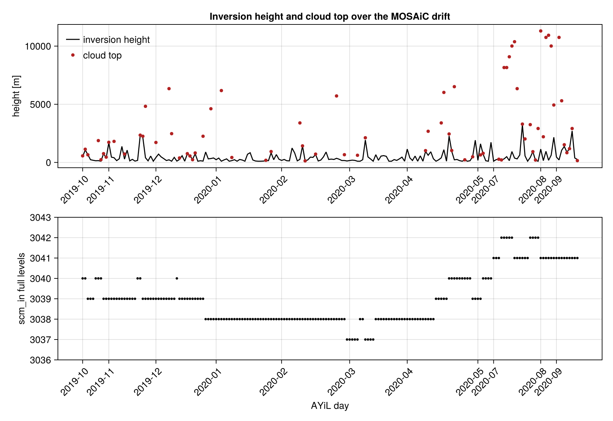
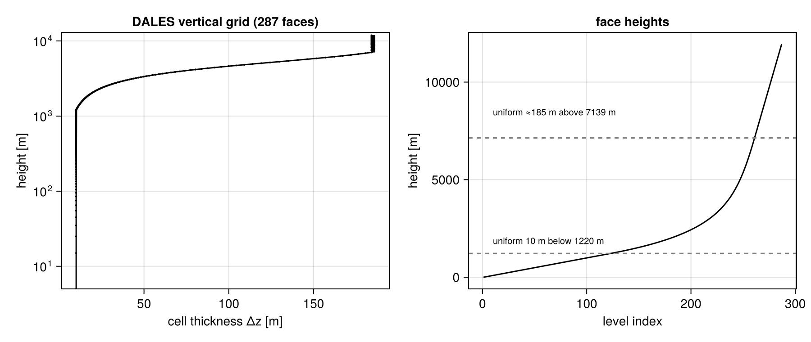
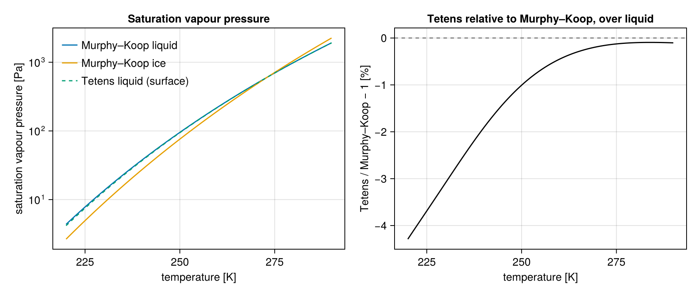

# MOSAiC_AYiL

Utilities for working with, processing, and regenerating full 3D/4D DALES output for [Schnierstein et al. 2024 (JAMES)](https://doi.org/10.1029/2024MS004296) / [Zenodo 10.5281/zenodo.10491362](https://zenodo.org/records/10491362).

Zenodo provides **profile-averaged** outputs; full horizontal fields require rerunning DALES with the archived inputs.

**Cursor / agents:** see [AGENTS.md](AGENTS.md) for pipeline entry points, conda env rules, Slurm, and known config facts.

## Simulation length and Slurm chunking

- **Default integration:** `runtime = 10800` s (**3 h**, JAMES paper). `prepare_case.sh` sets this in each run directory (`AYiL_DAY_RUNTIME_SEC`). Zenodo’s zip still ships `7200` s; git-tracked `namoptions` may lag until updated.
- **3D fielddump:** `dtav = 1800` → **6** snapshots per 3 h day. Zarr preset uses `FIELDDUMP_CHUNKS_TIME = 6`.
- **Local runs** (`run_local.sh`): one job per day, **`trestart = -1`** (no restart files).
- **Slurm (default):** `./scripts/slurm_submit.sh --pending` submits **6 chained jobs per day** (30 min sim each, `AYiL_CHUNK_SIM_SEC=1800`) so each job stays within typical **8 h wall** limits. Chunks warm-start from `initdlatest*`; timed restart files are deleted after each successful chunk; the last chunk does not write restarts. Many days can run in parallel (separate chains). Use `--no-chunked` only if your partition allows one job to finish the full 3 h simulation in walltime.
- **MPI ranks:** default **64** on Slurm (`AYiL_SLURM_NTASKS`); override in `scripts/env.local`.

### Fielddump + chunks (required reading)

**[`docs/fielddump_and_chunking.md`](docs/fielddump_and_chunking.md)** — why `profiles` can look fine while `fielddump` has `time=0`, and how chunk length relates to `dtav`.

**[`MOSAiC_AYiL/MOSAiC_AYiL_FORK.md`](MOSAiC_AYiL/MOSAiC_AYiL_FORK.md)** — **explicit list of Fortran changes** from upstream DALES (including `modfielddump.f90`). Rebuild with `./scripts/build_dales.sh` after pull.

**Do not** use `AYiL_CHUNK_SIM_SEC` &lt; **1800** unless you have rebuilt `dales4` from this repo’s `MOSAiC_AYiL` (see fork doc). Values like **300** or **600** with stock `tnext = btime + dtav` produce **empty fielddump** while the LES still runs to completion.

## Reproduce everything (start here)

```bash
cd /path/to/MOSAiC_AYiL
./scripts/reproduce.sh
```

That single command checks dependencies, sets up the build tree, compiles `dales4`, and runs a short smoke test. **All steps are implemented in `scripts/`**—see **[scripts/README.md](scripts/README.md)** for the full script list and production workflow.

Optional site config:

```bash
cp scripts/env.example scripts/env.local   # edit modules, paths, DALES_NPROC
```

**Inputs on a fresh clone:** Git tracks **`ayil_config_input_results/*/namoptions`** (pipeline settings such as `trestart = -1`). Large Zenodo artifacts (NetCDF, `prof.inp.*`, `*.001`, …) are not in git. The first `prepare_case` / run downloads [Zenodo `ayil_config_input_results.zip`](https://zenodo.org/records/10491362/files/ayil_config_input_results.zip) (~870 MiB) and **adds only missing files** (`rsync --ignore-existing` — it does not overwrite tracked `namoptions`). Prefetch: `./scripts/fetch_zenodo_inputs.sh`.

## Repository layout

| Path | Role |
|------|------|
| `scripts/` | **Canonical pipeline** (build, prepare, run, smoke test, Slurm example) |
| `MOSAiC_AYiL/` | AYiL DALES source + committed CMake bootstrap files |
| `ayil_config_input_results/YYYYMMDD/` | `namoptions` in git; Zenodo artifacts auto-downloaded on first run |
| `runs/` | Simulation working directories (created by scripts; gitignored) |
| `sim_dt/` | Versioned per-day timestep vs sim-time tables for Slurm wall estimates ([README](sim_dt/README.md)) |
| `python/` | Zarr conversion of a finished run ([README](python/README.md)) |
| `lib/julia/MOSAiCAYiL.jl/` | **Julia package**: reads the archive and the 3D output, and carries the per-day facts ([README](lib/julia/MOSAiCAYiL.jl/README.md), [docs](lib/julia/MOSAiCAYiL.jl/docs/src)) |

## Run simulations locally (no Slurm)

```bash
./scripts/diagnose_mpi.sh          # MPI path + rank limit on this machine
./scripts/run_local.sh 20200720    # auto-uses recommended NPROC (40 on sampo)
```

Use the scripts (they locate `mpirun` via `PATH`, modules, or `OPENMPI_PREFIX`). For manual MPI: `source ./scripts/setup_env.sh`.

## Run on Slurm (HPC)

For batch systems such as the [Caltech Resnick HPC cluster](https://www.hpc.caltech.edu) ([resource summary](https://www.hpc.caltech.edu/resources)):

```bash
cp scripts/env.example scripts/env.local   # modules, optional AYiL_SLURM_* overrides
./scripts/build_dales.sh                   # once on the login node
./scripts/list_cases.sh                    # pending vs complete
./scripts/slurm_submit.sh --pending --dry-run   # preview; no sbatch
./scripts/slurm_submit.sh --pending               # one job array for all eligible days
```

- **Does not submit** days that already have `runs/YYYYMMDD/.ayil_complete` (unless `--force`).
- **Does not submit** days marked `.ayil_running` (unless `--force`).
- Default: **one Slurm job array** for all eligible days; Slurm schedules tasks as resources allow (no artificial concurrency cap unless you set `AYiL_SLURM_ARRAY_MAX` in `env.local`).
- Slurm CPU/memory/time defaults are tuned for Caltech HPC but are **only environment defaults** — override in `env.local` on other clusters.

See **[scripts/README.md](scripts/README.md)** for `sbatch` options, single-day jobs, and monitoring.

## Tests

```bash
./test/run_tests.sh                    # bash pipeline
cd python && conda run -n MOSAiC_AYiL pytest   # Zarr conversion
```

## Zarr output (after a run finishes)

```bash
./scripts/convert_to_zarr.sh runs/20200720
```

See [python/README.md](python/README.md).

See [scripts/README.md](scripts/README.md).

## Analysis in Julia — [`lib/julia/MOSAiCAYiL.jl`](lib/julia/MOSAiCAYiL.jl)

The pipeline above **produces** the simulations. `MOSAiCAYiL.jl` **reads** them: the Zenodo
archive the runs consumed and produced, and the `fielddump` output a rerun writes.

```julia
using MOSAiCAYiL: MOSAiCAYiL as MA

c = MA.case("20200503")
MA.latitude(c), MA.inversion_height(c), MA.scm_in_levels(c)   # committed tables, no files
MA.read_variable("sv008", "20200503")                          # q_cloud_ice, corrected units
MA.testbed_forcing(c)                                          # the ERA5 forcing of that day
```

### What it gives you

- **One reader over all five archive files.** `read_variable` reaches every variable of
  `scm_in`, `profiles.001.nc`, `tmser.001.nc`, `mphysprofiles.001.nc` and
  `samptend.001.nc`, translating `sv008` → `q_cloud_ice` and correcting the units the
  archive states wrongly (the twelve SB3 scalars are numbers per unit *mass* labelled
  `(kg/kg)`; `*_rate` is a mixing ratio times a fall speed labelled `kg/m2`).
- **The 3D output, read lazily off its MPI tiles.** `open_fielddump` reads metadata only and
  stitches `fielddump.III.JJJ.NNN.nc` onto the global grid on demand, keeping the
  Arakawa-C staggering (`v` on `ym`, `w` on `zm`). A day is 6.2 GB across 19 variables, so a
  horizontal level costs one strided read per tile.
- **Zarr v3, written from Julia.** `using Zarr` adds `write_zarr`/`open_zarr`, an
  alternative to [`scripts/convert_to_zarr.sh`](python/README.md) that needs no Python and
  streams a chunk-row at a time.
- **Per-day facts with no I/O.** Latitude, skin temperatures, CCN, `scm_in` level count,
  inversion height and cloud top are committed tables looked up by date.
- **DALES's own thermodynamics**, dependency-free, with every constant read from
  `modglobal.f90`.
- **A ClimaAtmos extension** for driving a single-column model with an AYiL day.



*Per-day facts across the 190-day catalog. Both panels are table lookups — no archive file
is opened to produce them.*

### The grid and the physics it reproduces

Every day ran on the same 287 faces: uniform 10 m below 1220 m, a geometric stretch, then
uniform ≈185 m above 7139 m.



DALES evaluates saturation two ways — Murphy & Koop in the interior, Tetens/Murray at the
surface — and the package keeps them apart, because which one applies where is part of
reproducing the archive.



### Where the sources disagree

The JAMES paper, the AYiL DALES source and the Zenodo namelists conflict in places, and the
package implements the Fortran that wrote the archive. Both numbers are kept where it
matters — the 3 h paper protocol beside the 7200 s the Zenodo output actually ran, and the
paper's 55 μm initial ice beside DALES's `d_ci = 60 μm`.
[`docs/src/archive.md`](lib/julia/MOSAiCAYiL.jl/docs/src/archive.md) is the list.

```bash
cd lib/julia/MOSAiCAYiL.jl
julia --project=. -e 'using Pkg; Pkg.instantiate(); using MOSAiCAYiL'
julia --project=examples examples/read_the_archive.jl
```

Contact for the published dataset: Niklas Schnierstein (nschnier@uni-koeln.de).
